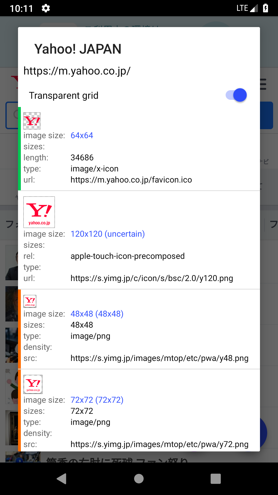
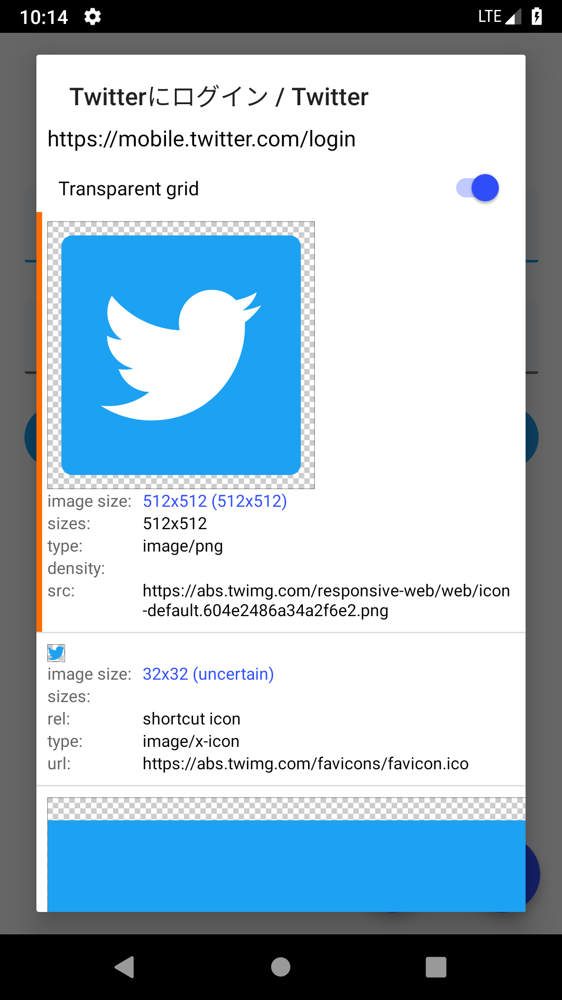
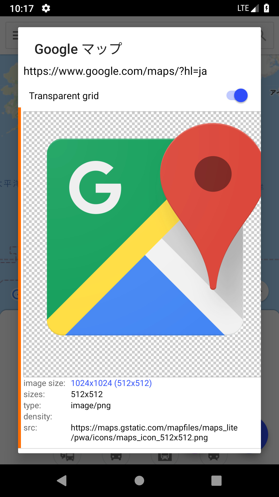

#  touch-icon-extractor

This is a sample app of [touch-icon-extractor](https://github.com/ohmae/touch-icon-extractor).

## Screenshots

This app is published in [Play store](https://play.google.com/store/apps/details?id=net.mm2d.webclip)

||||
|-|-|-|

## Dependent OSS

- [Kotlin](https://kotlinlang.org/)
  - kotlin-stdlib
  - kotlinx-coroutines-core
  - kotlinx-coroutines-android
- [Android Support Library](https://developer.android.com/topic/libraries/support-library/)
  - androidx.legacy:legacy-support-v4
  - androidx.appcompat:appcompat
  - androidx.constraintlayout:constraintlayout
  - androidx.preference:preference
  - com.google.android.material:material
- [Glide](https://bumptech.github.io/glide/)

## Author
大前 良介 (OHMAE Ryosuke)
http://www.mm2d.net/

## License
[MIT License](./LICENSE)
